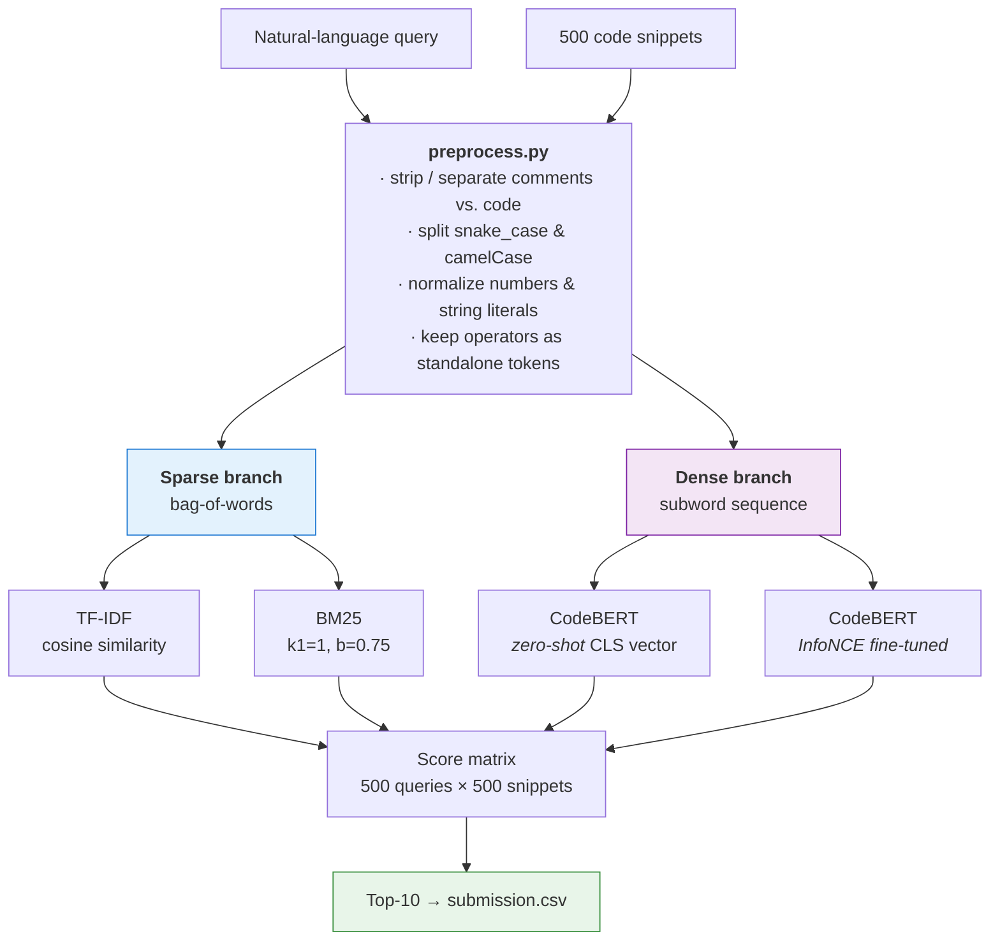
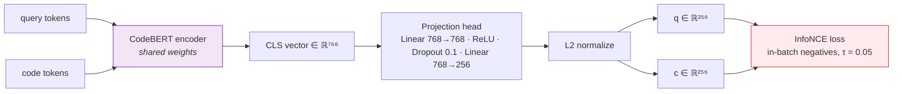
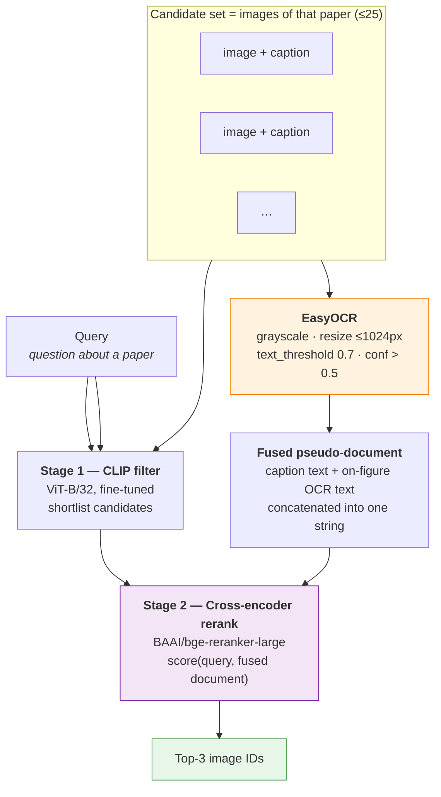

# NYCU_IR — Information Retrieval and Extraction, Fall 2025

| # | Assignment | Modality | Task | Headline result |
|---|------------|----------|------|-----------------|
| **HW1** | [`Codesearch/`](Codesearch/) | Text → **Code** | Retrieve the Python function that implements a described behaviour | **Recall@10 = 0.952** (fine-tuned CodeBERT) |
| **HW2** | [`Imagesearch/`](Imagesearch/) | Text → **Image** | Retrieve the figure from a scientific paper that answers a question | **0.94** public leaderboard (cross-encoder + OCR) |

---

## HW1 — Text-to-Code Retrieval

> `Codesearch/` · report: `pdf/IR_HW1.pdf`

### Task

Given a natural-language query $q$ (e.g. *"return the maximum value of two numbers"*), rank a
corpus of $|C| = 500$ Python code snippets and return the top-10. The evaluation metric is

$$\mathrm{Recall@}k \;=\; \frac{1}{|Q|}\sum_{i=1}^{|Q|} \mathbb{I}\big(\mathrm{GT}(q_i) \in \mathrm{Top\text{-}}k(q_i)\big)$$

Because each query has **exactly one** relevant snippet, Recall@10 here is equivalent to Hit@10.
A random ranker scores $10/500 = 0.02$ — this is the number every method must beat.

### Dataset

| Split | Rows | Columns |
|-------|------|---------|
| `data/code_snippets.csv` | 500 | `code_id`, `code` |
| `data/train_queries.csv` | 500 | `code`, `query` (aligned positive pairs) |
| `data/test_queries.csv` | 500 | `query_id`, `query` |

### Pipeline



#### 1. Preprocessing — [`preprocess.py`](Codesearch/preprocess.py)

A hand-written tokenizer, deliberately not a subword model, so the sparse branch operates on
*lexically meaningful* units:

```
"def initialize_bagit(self):"
  → ["def", "initialize", "bagit", "(", "self", ")", ":"]
```

The configuration (`PreprocessConfig`) exposes `lowercase`, `split_identifiers`,
`normalize_numbers` and `normalize_strings`. Comments (`//`, `/* */`, `#`, docstrings) are
extracted into a separate channel from executable code, so the two can be weighted or ablated
independently.

#### 2. Sparse retrieval — [`tfidf.py`](Codesearch/tfidf.py), [`BM25.py`](Codesearch/BM25.py)

Both are implemented from scratch (no `sklearn.feature_extraction`).

**TF-IDF** with sublinear term frequency and cosine normalization:

$$\mathrm{TF}(t,d) = 1 + \log f_{t,d}, \qquad \mathrm{IDF}(t) = \log\frac{N}{n_t}, \qquad w_{t,d} = \mathrm{TF}(t,d)\cdot\mathrm{IDF}(t)$$

$$\mathrm{Sim}(q,d) = \frac{\mathbf{v}_q\cdot\mathbf{v}_d}{\lVert\mathbf{v}_q\rVert\,\lVert\mathbf{v}_d\rVert}$$

**BM25 (Okapi)** with term-frequency saturation and document-length normalization:

$$\mathrm{BM25}(q,d) = \sum_{t\in q}\mathrm{IDF}(t)\cdot\frac{f_{t,d}\,(k_1+1)}{f_{t,d} + k_1\!\left(1-b+b\,\frac{|d|}{\mathrm{avgdl}}\right)}, \qquad \mathrm{IDF}(t) = \log\frac{N-n_t+0.5}{n_t+0.5}$$

IDF values and the per-document normalization factor $k_1(1-b+b\,|d|/\mathrm{avgdl})$ are
precomputed once at index time ([`BM25.py:47-59`](Codesearch/BM25.py#L47-L59)), reducing query
scoring to a sum over query terms that actually occur in the document.

#### 3. Dense retrieval — [`pre-trained.py`](Codesearch/pre-trained.py), [`fine-tuned.py`](Codesearch/fine-tuned.py)

Backbone: **`microsoft/codebert-base`** (RoBERTa-architecture, 50 265-token BPE vocabulary,
pre-trained with MLM + Replaced Token Detection on paired NL/PL corpora).

A **shared-weight bi-encoder** with a projection head maps both modalities into one
$\mathbb{R}^{256}$ space:



Training objective — **InfoNCE with in-batch negatives**: within a batch of $N$ pairs, the
$i$-th query treats its own snippet as the positive and the other $N-1$ snippets as negatives.

$$\mathcal{L} = -\frac{1}{N}\sum_{i=1}^{N}\log\frac{\exp\!\big(\mathrm{sim}(\mathbf{q}_i,\mathbf{c}_i)/\tau\big)}{\sum_{j=1}^{N}\exp\!\big(\mathrm{sim}(\mathbf{q}_i,\mathbf{c}_j)/\tau\big)}, \qquad \mathrm{sim}(\mathbf{q},\mathbf{c}) = \frac{\mathbf{q}\cdot\mathbf{c}}{\lVert\mathbf{q}\rVert\lVert\mathbf{c}\rVert}$$

| Hyper-parameter | Value |
|---|---|
| Backbone | `microsoft/codebert-base` (768-d) |
| Projection dim | 256 |
| Max sequence length | 256 tokens |
| Batch size | 8 (⇒ 7 in-batch negatives) |
| Epochs | 20 |
| Optimizer | AdamW, lr $2\times10^{-5}$ |
| Schedule | linear warmup over 10% of steps, then linear decay |
| Temperature $\tau$ | 0.05 |
| Seed | 42 |

At inference, all snippets are encoded once into $M \in \mathbb{R}^{n\times 256}$ and every query
is scored by a single matrix product $\mathrm{Sim}(\mathbf{q}, M) = \mathbf{q}M^{\top}$.

### Results

| Method | Type | Recall@10 | Cost |
|--------|------|-----------|------|
| TF-IDF | sparse | **0.864** | very low |
| BM25 ($k_1=1$, $b=0.75$) | sparse | 0.852 | low |
| CodeBERT, zero-shot `[CLS]` | dense | 0.024 | high |
| CodeBERT, InfoNCE fine-tuned | dense | **0.952** | high |

**Tokenizer ablation** (zero-shot CodeBERT, measured on the 500 train pairs):

| Tokenization fed to CodeBERT | Recall@10 |
|---|---|
| Native CodeBERT BPE | 0.144 |
| Custom lexical tokenizer → `convert_tokens_to_ids` | 0.034 |

### Analysis

- **Sparse beats zero-shot dense by 36×.** At Recall@10 = 0.024 the pre-trained encoder is
  statistically indistinguishable from the random baseline of 0.02. MLM and RTD produce
  representations optimized for *token reconstruction*, not for *sequence-level alignment*; the
  raw `[CLS]` vector simply is not a retrieval embedding. This is the single most instructive
  result in the assignment.
- **TF-IDF edges out BM25 (0.864 vs. 0.852)**, inverting the usual ordering. BM25's advantages —
  TF saturation and length normalization — assume long documents with repeated terms. These
  snippets are short and no single identifier dominates, so saturation buys nothing while cosine
  normalization on the TF-IDF side does the length correction more directly.
- **Feeding a custom tokenizer into a subword model is actively harmful** (0.144 → 0.034).
  Lexical tokens like `initialize` are mapped through `convert_tokens_to_ids` against a BPE
  vocabulary they were never registered in, so most map to `<unk>`. The tokenizer must match the
  model that consumed it during pre-training — a good tokenizer for the sparse branch is a bad
  one for the dense branch.
- **Fine-tuning recovers everything and more (0.024 → 0.952).** Twenty epochs of InfoNCE on 500
  pairs is enough to reshape the embedding geometry, because contrastive learning optimizes the
  exact quantity being evaluated: relative rank under cosine similarity.

---

## HW2 — Text-to-Figure Retrieval

> `Imagesearch/` · report: `pdf/IR_HW2.pdf`

### Task

Given a question about a scientific paper, retrieve the **figure from that paper** which answers
it. Crucially, the candidate set is scoped per paper (≤ 25 images), turning a corpus-wide
retrieval problem into a **hard re-ranking problem within a narrow, topically homogeneous
candidate set** — every candidate comes from the same paper, so lexical topic overlap carries
almost no signal.

Submission returns the **top-3** image IDs per query.

### Dataset

| File | Rows | Papers | Contents |
|------|------|--------|----------|
| `train.jsonl` | 8 230 | 1 646 | `id`, `paper_id`, `query`, `image_id`, `image_path`, `image_caption` |
| `test.jsonl` | 403 | 50 | `id`, `paper_id`, `query` |
| `test_images.jsonl` | 753 | 50 | `paper_id`, `image_id`, `image_caption`, `image_path` |

≈ 15 candidate images per test paper.

### Method Progression

Five architectures were evaluated. The narrative of this assignment is that the **visual**
approaches lost to the **textual** ones — and that the deciding signal turned out to be text
*inside* the images.



**① Zero-shot CLIP** — `openai/clip-vit-base-patch32`, cosine similarity between the query text
embedding and each image embedding. Strong on train, weak in generalization.

**② Fine-tuned CLIP** — contrastive fine-tuning with a *document-scoped* negative mask, which is
the interesting bit. Standard CLIP training uses all in-batch negatives; here the loss is masked
so that only images **from the same paper** count as negatives:

```python
same_paper    = paper_ids[:, None] == paper_ids[None, :]
positive_mask = torch.eye(B, dtype=torch.bool)
negative_mask = same_paper & ~positive_mask      # same paper, different image
valid_mask    = positive_mask | negative_mask    # everything else is ignored
masked_logits = logits.masked_fill(~valid_mask, -1e9)
loss = 0.5 * (F.cross_entropy(masked_logits, labels)      # text → image
            + F.cross_entropy(masked_logits.T, labels))   # image → text
```

This matches the training objective to the evaluation condition — the model is only ever asked to
discriminate *within* a paper, which is exactly what the test set requires. Hyper-parameters:
AdamW, lr $5\times10^{-6}$, batch 15, $\tau = 0.07$, 10 epochs, symmetric bidirectional loss.

**③ SentenceTransformer over captions** — `intfloat/e5-large-v2`, bi-encoder cosine similarity
between query and caption. Discards pixels entirely, and *beats* fine-tuned CLIP.

**④ Cross-encoder over captions** — `BAAI/bge-reranker-large` jointly encodes
`[query, caption]` and produces a relevance logit. Affordable precisely because the candidate set
is ≤ 25, so full $O(|Q|\times|C_{\text{paper}}|)$ joint encoding is tractable.

**⑤ Cross-encoder over caption + OCR** *(best)* — EasyOCR extracts on-figure text (axis labels,
legends, method names, table headers), which is concatenated with the caption into a single
pseudo-document before re-ranking.

**⑥ Dual-encoder** *(explored, not submitted)* — frozen `microsoft/convnext-tiny-224` +
`all-MiniLM-L6-v2` with two trainable projection heads into $\mathbb{R}^{256}$; only the
projections were optimized (AdamW, lr $10^{-3}$). More architectural freedom, more tuning burden,
no gain over the cross-encoder.

### Results

| # | Method | Signal used | Public score |
|---|--------|-------------|--------------|
| ① | Zero-shot CLIP ViT-B/32 | pixels | strong on train, drops on test |
| ② | Fine-tuned CLIP (document-scoped mask) | pixels | ≈ 0.62 (plateau) |
| ③ | SentenceTransformer `e5-large-v2` | captions | > ② |
| ④ | Cross-encoder `bge-reranker-large` | captions | **0.83** |
| ⑤ | Cross-encoder + **OCR** | captions + on-figure text | **0.94** |

Public leaderboard progression:

| Configuration | Score | |
|---|---|---|
| Fine-tuned CLIP | 0.62 | `████████████▍            ` |
| Cross-encoder (captions) | 0.83 | `████████████████▌        ` |
| Cross-encoder + OCR | **0.94** | `██████████████████▊      ` |

### Analysis

- **Pixels lost to text.** Scientific figures — plots, architecture diagrams, result tables — are
  far outside CLIP's natural-image pre-training distribution. The caption is a human-written,
  domain-accurate description; the image encoder never learned to read a $y$-axis.
- **OCR was the single largest win (+0.11).** Queries frequently mention domain-specific terms
  (dataset names, metric names, ablation labels) that appear *rendered inside the figure* but
  never in the caption. OCR converts an unreadable modality into the modality the reranker is
  already good at.
- **Cross-encoder > bi-encoder because the candidate set is small.** Joint query–document
  attention resolves fine distinctions that independently-computed embeddings blur, and with
  ≤ 25 candidates the quadratic cost never bites.
- **The generalization gap drove the final design.** CLIP consistently outperformed on train but
  collapsed on public test, suggesting the public split is biased toward caption-retrievable
  samples. To hedge against the private split having the opposite bias, the final system is a
  **two-stage hybrid**: CLIP filters the candidate pool, the cross-encoder makes the final pick.
  This is an explicit robustness trade — giving up some public score for variance reduction.
- **A note on `hash(pid)` in the CLIP mask.** Python string hashing is salted per process
  (`PYTHONHASHSEED`), so the `paper_id → int` mapping is not stable across runs. It is
  collision-safe *within* a run, which is all the mask requires, but it makes runs
  non-reproducible; a deterministic `paper_id → index` dict would be the fix.
